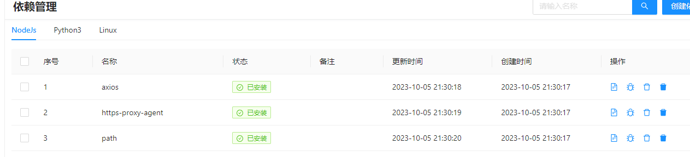
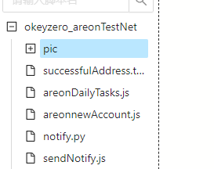
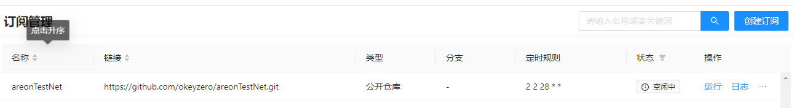
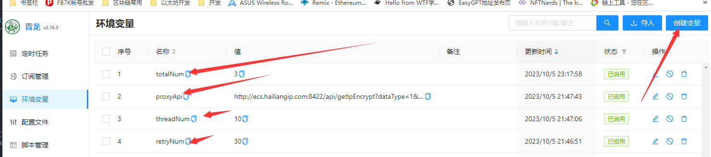
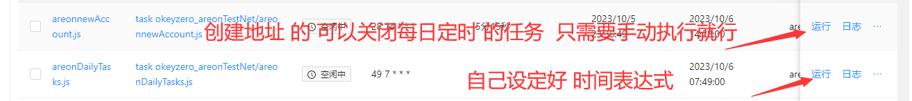
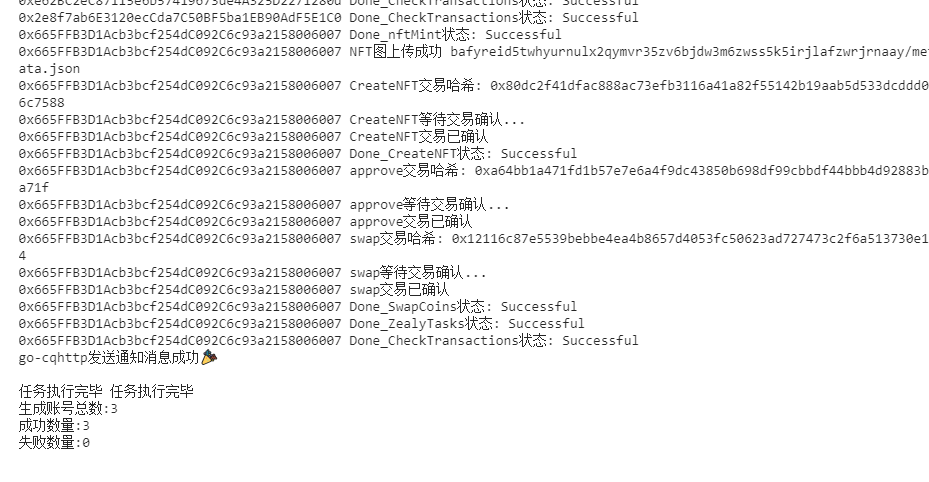
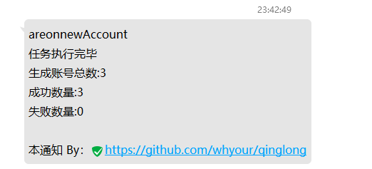

# 本地执行

npm i

#### 配置.env 文件

proxyList 代理链接 (账密格式得 多个代理链接用逗号分割)
proxyApi 代理 api 支持 一个链接提取多个 ip
threadNum 同时执行任务数量
totalNum 创建钱包并执行得总数
retryNum 重试次数 建议 大一点 因为限制 ip 代理不稳定
【注】
proxyList 和 proxyApi 只填一个就行 最好把另外一个删除

可以直接创建新号 也可以 导入新号(手动创建 `successfulAddress.txt` 文件 内容格式 为 `地址----私钥` 一行一号)

#### 复制图片

因为要创建 nft 需要上传图片 所以 再 ./pic 文件夹下 手动复制 随机上传得 图片（建议多找一些 不同类型得）

#### 直接创建新号

node areonnewAccount.js

#### 每日养号

node areonDailyTasks.js

# 青龙挂着每日养号

配置环境变量

安装 node 依赖

```
axios
https-proxy-agent
ethers@5.7.2
path
```

添加订阅

```
名称：areonTestNet
公开仓库 https://github.com/okeyzero/areonTestNet.git
定时规则 2 2 28 * *
白名单 areonDailyTasks.js|areonnewAccount.js
点确定 保存 运行一下
```

因为要创建 nft 需要上传图片 所以 在脚本管理 okeyzero_areonTestNet/pic 文件夹下 手动复制 随机上传得 图片（建议多找一些 不同类型得）如果图片较多 可以 上传压缩包 自己进入 shell 去解压


因为我 ethers (5.7.2) 版本 是在 shell 安装的 所以 这里没显示





